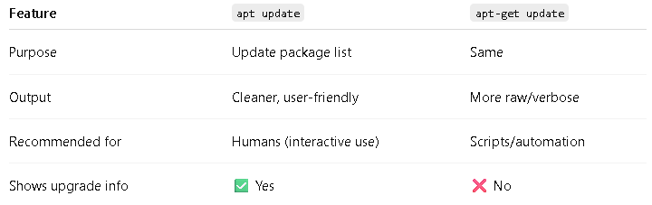
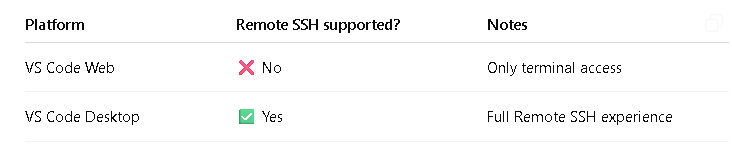
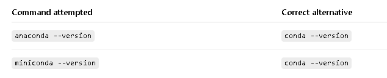

 *[ctr + shift +v to view]*

# Day_01/22March2026

## Installing Google SDK and Experimenting with GCP VM on Codespace

**1. Remove any broken/old repo (safe to run)**

sudo rm -f /etc/apt/sources.list.d/google-cloud-sdk.list

**2. Add Google Cloud GPG key (modern method)**

curl -fsSL https://packages.cloud.google.com/apt/doc/apt-key.gpg \
| sudo gpg --dearmor -o /usr/share/keyrings/google-cloud.gpg

**3. Add Google Cloud SDK repository**

echo "deb [signed-by=/usr/share/keyrings/google-cloud.gpg] https://packages.cloud.google.com/apt cloud-sdk main" \
| sudo tee /etc/apt/sources.list.d/google-cloud-sdk.list

**4. Update packages**

sudo apt-get update

**5. Install Google Cloud CLI**

sudo apt-get install google-cloud-cli -y

**6. Verify installation**

gcloud version

**7. Login (Codespaces / remote environment)**

gcloud auth login --no-launch-browser

---------------------------------------------------------------------------------
*[Q.Why do we run apt-get update?]*

What actually happens behind the scenes?

Linux (Debian/Ubuntu) uses APT (Advanced Package Tool), which maintains a local database of:

Available software packages
Their versions
Dependencies
Download URLs

When you run:

sudo apt-get update

👉 It does NOT install anything
👉 It just downloads the latest package index from configured repositories



## Setting gcloud project-id

$ gcloud projects list

$ gcloud config set project mlops-490916

$ gcloud config get-value project

## Setting-up SSH access

Q. What SSH is?

SSH is like having a secure, invisible cable directly connecting your computer to a remote server, letting you work on it as if you were sitting in front of it.

SSH = Secure Shell

It’s a protocol for encrypted communication between computers.
Commonly used to access remote servers, VMs, or cloud machines.
Replaces older, insecure protocols like Telnet.

🔹 How SSH works

You have a client (your laptop, Codespace, etc.)

You want to connect to a server (GCP VM, cloud instance)

SSH uses public-key cryptography to authenticate you:

You generate a key pair:

Private key → stays on your local machine

Public key → added to the server

When you connect, the server checks your private key against the public key.

The connection is encrypted, so your username, password (if used), and commands are safe from eavesdropping.


$ gcloud compute instances list

$ gcloud compute instances start vm-mlops

------------------------------------------
[No zone specified. Using zone [us-central1-c] for instance: [vm-mlops].

Starting instance(s) vm-mlops...

done.                                                                                                               

Updated [https://compute.googleapis.com/compute/v1/projects/mlops-490916/zones/us-central1-c/instances/vm-mlops].

Instance internal IP is 10.128.0.2

Instance external IP is 34.42.157.200]

----------------------------------------------------
$ gcloud compute config-ssh

This does a few things:

Creates ~/.ssh/google_compute_engine keys (if not existing)

Adds your public key to the VM metadata

Updates your local ~/.ssh/config with a host entry like:

instance_name.zone.project 

[ssh vm-mlops.us-central1-c.mlops-490916]

$ ssh instance_name.zone.project

[You should now be logged into your VM.]



## Working with VM instance

codespace@vm-mlops:~$ ls

codespace@vm-mlops:~$ sudo apt update && sudo apt -y upgrade

codespace@vm-mlops:~$ sudo terraform version

codespace@vm-mlops:~$ sudo docker version

codespace@vm-mlops:~$ sudo docker run hello-world

Ah, Docker Compose is a really handy tool once you start working with **multiple containers**. Let me explain clearly.

---

# 🔹 What Docker Compose is

**Docker Compose** is a **tool for defining and running multi-container Docker applications**.

* With regular Docker, you run **one container at a time**:

```bash
docker run -d -p 5000:5000 my-app
```

* With Docker Compose, you can define **multiple containers, networks, and volumes** in a **single YAML file** and start them all at once.

---

# 🔹 Key idea

* You create a file called **`docker-compose.yml`**.
* You define:

1. **Services** → containers you need (web server, database, Redis, etc.)
2. **Networks** → how containers communicate
3. **Volumes** → persistent storage

Example:

```yaml
version: "3.9"
services:
  web:
    image: nginx:latest
    ports:
      - "8080:80"
  db:
    image: postgres:15
    environment:
      POSTGRES_USER: user
      POSTGRES_PASSWORD: pass
      POSTGRES_DB: mydb
```

* Here, `web` and `db` are **two containers**.
* Compose automatically creates a **network** so they can talk to each other.

---

# 🔹 Common commands

| Command                                   | What it does                                                            |
| ----------------------------------------- | ----------------------------------------------------------------------- |
| `docker-compose up`                       | Starts all containers defined in `docker-compose.yml`                   |
| `docker-compose up -d`                    | Starts containers in **detached mode** (background)                     |
| `docker-compose down`                     | Stops and removes all containers, networks, and volumes created by `up` |
| `docker-compose logs`                     | Shows logs for all services                                             |
| `docker-compose exec <service> <command>` | Run a command in a running service container                            |

---

# 🔹 Why it’s useful

* **Manage complex applications easily** → You don’t need multiple `docker run` commands.
* **Version control** → Your YAML file defines exactly how your app runs.
* **Reproducible environments** → Great for MLOps pipelines, dev/test/production parity.
* **Networking & dependencies** → Docker Compose ensures containers start in the correct order (like DB first, then app).

---

# 🔹 Example in MLOps

Suppose you have:

1. **ML API service** (FastAPI / Flask)
2. **Database** (PostgreSQL)
3. **Redis cache**

With Docker Compose, you can start all three with a **single command**:

```bash
docker-compose up -d
```

And they will automatically communicate via the **default network**.

---

💡 **Bottom line:**
Docker Compose is like a **recipe for multi-container apps** — define once in a YAML, and start all your services consistently and reproducibly.

---

## As all installation --> Docker, Docker-compose, Terraform, Miniconda have already been done, for today you can exit VM and close the machine:

**To exit from your GCP VM SSH session, go back to your original Codespace terminal, and then stop the VM to save costs. Here’s exactly how to do it:**

codespace@vm-mlops:~$ exit
logout
Connection to 34.42.157.200 closed.

We can reconnect:

$ ssh vm-mlops.us-central1-c.mlops-490916

Then, exit

codespace@vm-mlops:~$ exit

@learnermp ➜ /workspaces/MLOPs_Taxi_Codesapce (main) $ gcloud compute instances list

@learnermp ➜ /workspaces/MLOPs_Taxi_Codesapce (main) $ gcloud compute instances stop vm-mlops --zone=us-central1-c

## Installing miniconda on codespace

We will not install miniconda on codespace as codespace already contains it.

## To create virtual environment

$ conda create -n myenv python=3.12 -c conda-forge

$ conda init

$ source ~/.bashrc

[This applies the changes made by conda init.]

$ conda activate myenv

-----------------------------------
## Using pip inside a Conda environment

````markdown
## Notes / Best Practice

- **Prefer Conda first** for packages like `numpy`, `pandas`, `scipy`, `scikit-learn` because Conda handles dependencies better:

```bash
conda install pandas -c conda-forge
````

* **Use pip if:**

  * Package is not available in Conda channels
  * You need the latest version

* You can safely **mix Conda + pip** inside the same environment, but **always install Conda packages first, then pip**.

$ conda --version



In Codespaces, Conda is already installed. You don’t need anaconda or miniconda commands, just use conda and conda activate.

## Installing docker on codespace

$ sudo apt install docker.io 

Change your settings so that you can run Docker without sudo:

$ sudo groupadd docker

$ sudo gpasswd -a $USER docker

Log out of your SSH session and log back in [If installing on GCP VM]

$ sudo service docker restart

Test that Docker can run successfully with docker run hello-world

$ docker version

Docker version 28.2.2, build 28.2.2-0ubuntu1~24.04.1

## Installing Docker Compose on Codespace

Here’s your Docker Compose installation notes in clean **Markdown format**:

````markdown id="docker_compose_notes"
# Install Docker Compose in Codespaces (within `myenv`)

### 1️⃣ Create a `bin` directory in your home
```bash
mkdir -p ~/bin
cd ~/bin
````

> This will store custom binaries like Docker Compose.

---

### 2️⃣ Download the latest Docker Compose binary

* Check the latest version on [Docker Compose releases](https://github.com/docker/compose/releases).
* Replace `<latest_version>` with the version number, e.g., `v2.22.0`.

```bash
wget https://github.com/docker/compose/releases/download/v2.22.0/docker-compose-linux-x86_64 -O docker-compose
```

---

### 3️⃣ Make it executable

```bash
chmod +x docker-compose
```

* Confirm it’s executable:

```bash
ls -l docker-compose
```

* You should see permissions like `-rwxr-xr-x`.

---

### 4️⃣ Add `~/bin` to your PATH

```bash
echo 'export PATH="$HOME/bin:$PATH"' >> ~/.bashrc
source ~/.bashrc
```

> Now `docker-compose` can be run from **any directory**.

---

### 5️⃣ Verify Docker Compose installation

```bash
docker-compose version
```

* Expected output:

```text
Docker Compose version v2.22.0
```
```
cd
```
## Unstalling wrong version of Terraform

(myenv) @learnermp ➜ ~ $ which terraform
/home/codespace/bin/terraform
(myenv) @learnermp ➜ ~ $ sudo rm /home/codespace/bin/terraform
(myenv) @learnermp ➜ ~ $ which terraform

# Installing Correct Vesrion of Terraform

1. Download and install the latest Terraform version:

cd ~/bin

wget https://releases.hashicorp.com/terraform/1.14.7/terraform_1.14.7_linux_amd64.zip

unzip terraform_1.14.7_linux_amd64.zip

chmod +x terraform

2. Ensure ~/bin is in your PATH:

echo 'export PATH="$HOME/bin:$PATH"' >> ~/.bashrc

3. terraform version

4. which terraform

=================================================================

# Fixing .ipynb issue

```
pip install ipykernel
```

Add the conda-forge channel (which contains ipykernel) and set channel priority to avoid conflicts:

```
bash
conda config --add channels conda-forge
conda config --set channel_priority flexible
```

```
conda install ipykernel -y
```

Select the kernel in your .ipynb file:

Click on the kernel picker in the top‑right corner.

Choose Python (myenv) (the display name you set) or the environment you just installed into

Test by running a simple cell:

```
import numpy as np
print("Kernel is working!")
```
