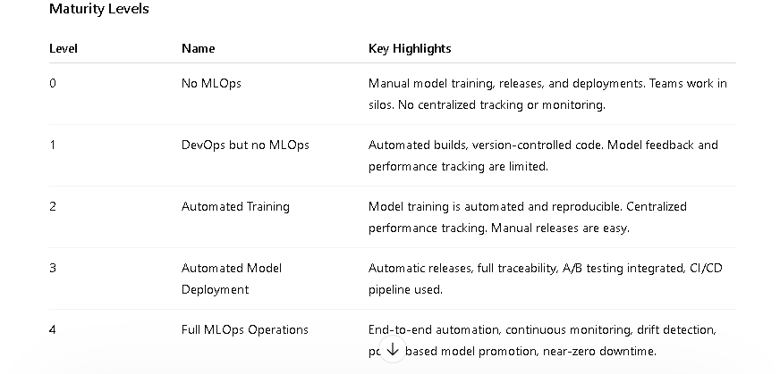

# MLOps Maturity Model — Summary for Beginners

The **MLOps maturity model** is a framework to assess, plan, and improve your organization's machine learning operations. It helps you gradually move from ad-hoc model work to fully automated production ML systems.

---

## 🔹 Purpose

- Assess your current MLOps capabilities.
- Identify gaps in processes, people, and technology.
- Plan incremental improvements.
- Set realistic success criteria and deliverables.

---

---

## 🔹 Key Characteristics by Level

### Level 0: No MLOps
- Teams work in isolation.
- Manual data gathering and model training.
- Manual releases and deployments.
- No experiment tracking.

### Level 1: DevOps but no MLOps
- Automated code builds and tests.
- Version-controlled model scoring scripts.
- Limited integration testing.

### Level 2: Automated Training
- Collaboration between data scientists and engineers.
- Managed compute and reproducible experiments.
- Automated model training with centralized tracking.
- Releases still manual but easier.

### Level 3: Automated Model Deployment
- Automatic releases via CI/CD.
- Full traceability from data to deployment.
- Integration testing for models.
- Less dependency on individual expertise.

### Level 4: Full MLOps Operations
- Fully automated training, testing, and deployment.
- Automatic retraining triggered by metrics/drift.
- Policy-driven model promotion.
- Continuous monitoring and feedback for system improvement.

---

## 🔹 Additional Notes

- Focus of this model: classical predictive ML (tabular, supervised).
- **GenAIOps** (for generative AI) builds on MLOps levels, adding:
  - Prompt lifecycle management.
  - Retrieval augmentation.
  - Output safety and token cost governance.
- Maturity improves culture, processes, and technology together.

---

## ✅ Takeaway for Beginners

- Start at your current level (0–1) and incrementally improve.
- Automate training before deployment.
- Implement CI/CD pipelines for reproducible and traceable workflows.
- Use centralized tracking and monitoring for models in production.
- Treat MLOps as **people + process + technology** improvement, not just tools.